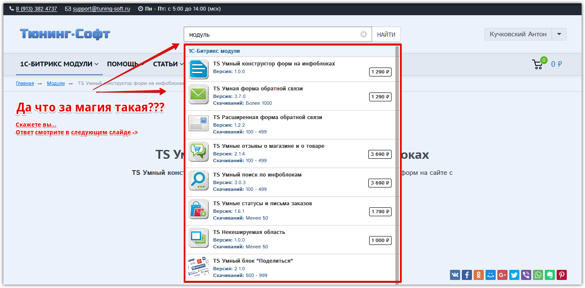
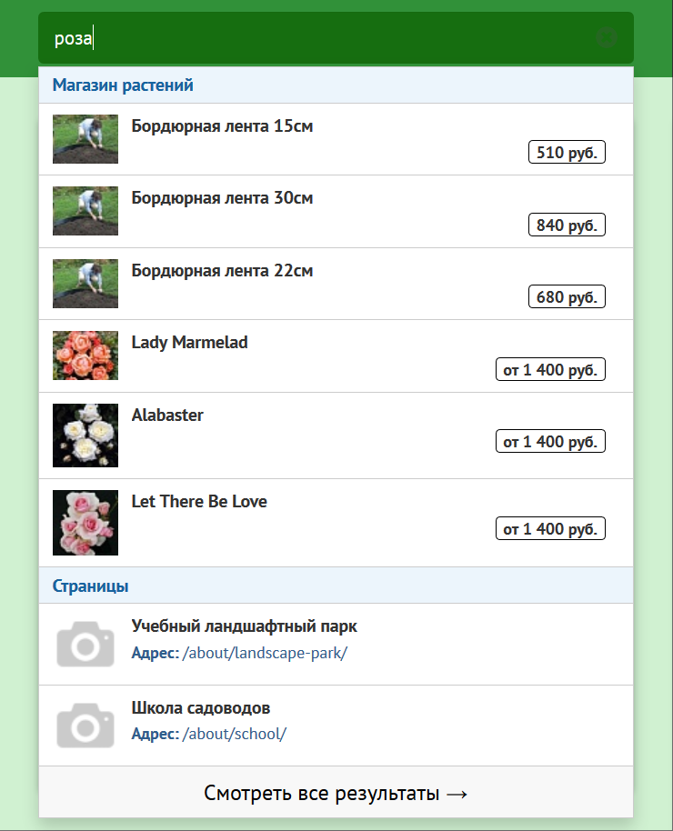

# api.search

## TS Умный поиск по инфоблокам (api.search)
   TS Умный битрикс поиск по инфоблокам и свойствам - очень умная система поиска битрикс на аякс по названию элемента, по свойствам, по артикулу, по тегам, др. полям и свойствам инфоблока.
   
   Основные возможности системы поиска битрикс
   В комплекте три компонента Поиск по заголовкам, Результаты поиска, Результаты поиск (каталог);
   Ищет по нескольким инфоблокам;
   Возможен поиск по названию товара, поиск по свойствам товара, поиск по артикулу, поиск по тегам и др. полям и свойствам инфоблока;
   * Не использует поисковый индекс Битрикс, используется свой внутренний алгоритм;
   *** Возможность разбивать результаты поиска по категориям;
   Возможность поиска в двух режимах,  по точному совпадению слов и по вхождению слов в строку (рекомендуется, включен по умолчанию)
   Возможность переключать режим поиска с помощью параметров из адресной строки sm=exact, например: ?q=Аксессуар+NEOMAX&sm=exact
   где &sm=exact - включает режим точного совпадения, иначе работает режим по умолчанию, по вхождению слов в строку.
   Возможность передавать глобальную переменную apiSearchFilter в фильтр каталожных компонентов и реализовать страницу результатов поиска на стандартных Битрикс компонентах, например bitrix:catalog.search, bitrix:catalog.section;
   Возможность вывода цен и скидок с конвертацией валют;
   Возможность ресайза изображений (размер можно задавать двумя способами: 64x64 или 64)
   Возможность задать двойную сортировку элементам в результатах;
   Возможность отключить встроенные стили компонентов  и применить свои;
   Современный, адаптивный и красивый дизайн;
   Прост в установке и настройке;
   + в планах реализация очень клевых и интересных функций, и шаблонов поиска.
   * - поисковый индекс Битрикс хранится в БД сайта, занимает место,  на больших магазинах это даже гигабайты, обновляется при каждом изменении элементов, часто работает не должным образом.
   
   *** - Если задано ограничение на результаты поиска в компоненте Поиск по заголовкам и заданы категории поиска, то результат будет подстраиваться под заданное ограничение, например: всего 30 товаров в результатах задано в настройках + 3 категории поиска, компонент будет стараться в каждой категории находить максимальное количество значений по формуле 30 / 3 = 10, т.е. в каждой категории будет максимум 10 результатов, но если в первой категории было всего 2 результата, то во второй категории компонент может вывести (10 - 2) + 10 = 18 элементов, а в третьей будет 10, итого всего 30 элементов.
   Пока сделана разбивка результатов поиска по категориям только в одном компоненте Поиск по заголовкам, чуть позже сделаем во втором.
   Мультиязычность Битрикс
   Это второй модуль, в котором я реализовал максимально гибкую поддержку многоязычности.
   Все лэнги для компонентов берутся из их шаблонов, т.е. даже при копировании шаблона компонента все лэнги для компонента будут браться из скопированного шаблона, все тексты, все сообщения и т.д.
   Т.е. для каждого языка сайта вы можете в шаблонах компонента все тексты изменять и для компонента.
   
   Тексты сообщений из настроек компонента также можно переопределить в лэнгах шаблона, лэнгам шаблона я сделал максимальный приоритет, если они там прописаны, то подключаются в первую очередь лэнги из шаблона, независимо от настроек компонента, наглядно выглядит это так:
   
   
   
   В красном прямоугольнике выделены пустые лэнги, вот если в них что-то вписать, то они будут подключаться и в шаблоне, и в компоненте в первую очередь, даже если заданы в настройках компонента, пока они пустые, используются лэнги из настроек компонента.
   jQuery плагины
   Для шаблона компонента Поиск по заголовкам написан jQuery-плагин:
   ```php
   $.fn.apiSearchTitle
```

   Он подключается автоматически в шаблоне компонента в файле script.js
   У плагина есть настройки, пока они заданы в самом шаблоне.
   При копировании шаблона компонента вы максимально сможете изменять плагин под свои задачи.
   
   Системные требования
   Модуль я постарался сделать максимально совместимым со старыми редакциями, протестирован на редакциях:
   
   1С-Битрикс: Управление сайтом 15.5
   Версия jQuery 1.8.3 + (либо на сайте, либо в настройках модуля включить)
   Версия php 5.3 +
   
   Обратите внимание!
   1) Поиск ищет только по элементам инфоблока.
   
   2) У модуля хитрая логика поиска, если вы введете две буквы, например по, то ничего конкретного скорее всего не найдете, если ищете слово почетный, то найдете абсолютно все элементы с этим словом.
   Также будет искать по вариациям: почетная грамота, грамота почетная, грамоты, почетный и т.д.
   
   3) Если не заработало или не появляются всплывающие результаты поиска, значит надо в настройках компонента попробовать подключить jQuery, если опять не заработали, значит какой-то конфликт библиотек jQuery, надо будет разбираться с проблемой, из коробки все работает.
   
   4) Чем больше свойств вы укажите для поиска, тем медленнее он будет работать, но чаще всего это Название товара и свойство Артикул.
   Максимум 30 свойств можно выбрать, если ничего не выбрано, то поиск ищет только в названиях элементов.
   
   5) Система поиска битрикс протестирована в каталоге более 60 000 шт. товаров, по названию и артикулу ищет быстро, если у вас работает очень медленно, рекомендую задуматься над оптимизацией своего сайта, либо над сменой хостинга на более мощный, либо удалить модуль и пользоваться стандартным поиском Битрикс.
   
   
   
   
   
   
   
   
   
   
   
   
   
   
   
   